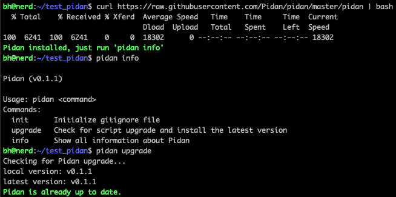
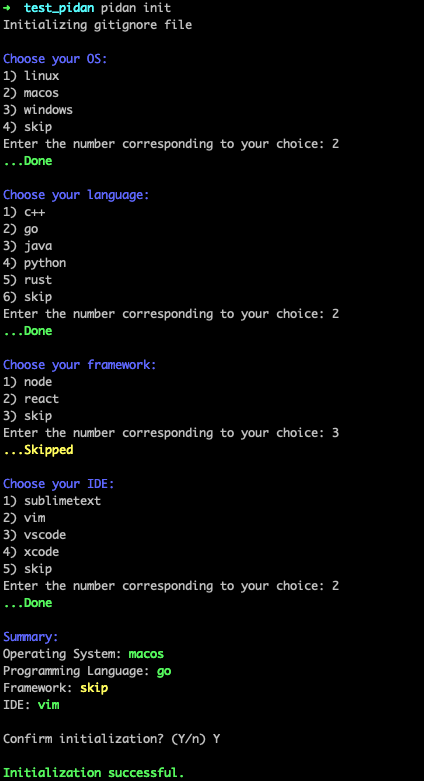

# Pidan
Initialize gitiginore file for your project

### Intro

`pidan` is a simple bash script to initialize gitignore file for your project.

### Install

```
curl https://raw.githubusercontent.com/Pidan/pidan/master/pidan | bash
```



### How to use

```
Usage: pidan <command>...
Commands:
  init      Initialize gitignore file
  upgrade   Check for script upgrade and install the latest version
  info      Show all information about Pidan
```



### How to Collaborate

Please feel free to submit your PRs and issues.

### Copyright

[MIT](LICENSE)

Copyright (C) 2023-present, Bin Hua